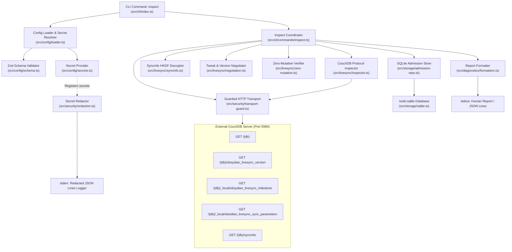

# Phase 1: Guarded Read-Only Admission — Walking Skeleton Specification

**Phase:** 1 (Guarded Read-Only Admission)  
**Project:** `obsidian-livesync-headless`  
**Status:** DRAFT (Walking Skeleton Architecture Baseline)  
**Date:** 2026-09-03  

---

## 1. Executive Summary & Purpose

The Walking Skeleton is the thinnest production-grade implementation that connects every architectural layer of `obsidian-livesync-headless` end-to-end. As Phase 1 of a greenfield project, it establishes:
1. **The Tooling & Runtime Baseline:** Node.js 24 LTS, TypeScript 5.9.3, Vitest 4.1.11, exact pinned dependencies (`@vrtmrz/livesync-commonlib@0.1.21`, `yaml@2.9.0`, `zod@4.5.4`), and project layout.
2. **The Guarded Read-Only Admission Pipeline:** A complete, fail-closed path from CLI invocation to remote CouchDB discovery, cryptographic verification, SQLite admission persistence, and structured diagnostics without a single remote write.
3. **The Architectural Invariants:** Structural read-only transport enforcement (`GET`/`HEAD` only), administrative endpoint exclusion, credential redaction across all outputs, and destination path safety.

Subsequent phases (Verified Pull, Recoverable Pull, Armed Bidirectional Sync, Daemon, and Packaged Release) build directly atop the abstractions, storage schema, transport guard, and logger established in this skeleton.

---

## 2. Layered Architecture & Component Boundary Map

The system is designed as a single-process modular monolith with strict unidirectional dependencies. The domain and application logic never directly invoke raw `fetch` or mutating PouchDB/CouchDB APIs.



### Boundary Responsibilities

| Layer | Primary Module | Invariants & Guardrails |
|---|---|---|
| **CLI Dispatch** | `src/cli/index.ts` | Built-in `node:util.parseArgs`; dispatches `--config` and `--json` flags; maps outcome categories to process exit codes. Never throws unhandled exceptions. |
| **Configuration** | `src/config/` | Strict YAML parsing via `yaml@2.9.0`; environment and file secret resolution; strict Zod schema validation; canonical vault path verification (blocks root `/`, home `~`, parent traversal `..`, and state directory overlap). |
| **Security & Transport** | `src/security/` | Centralized `SecretRedactor` scrubbing all URLs, Basic auth, Bearer tokens, setup URIs, and error stacks. `createGuardedFetch` mechanically enforces `GET`/`HEAD` allowlist, origin identity, and denies administrative endpoints. |
| **LiveSync Protocol** | `src/livesync/` | Pure read-only CouchDB inspector using exact Commonlib document IDs; Web Crypto HKDF syncinfo decrypt verification; version gate (`VER <= 12`); tweak classification (`IncompatibleChanges` vs `CompatibleButLossyChanges`); exhaustive check against `RECOGNIZED_TWEAK_KEYS`; pre/post `ZeroMutationVerifier` assertions. |
| **Local Storage** | `src/storage/` | Transactional SQLite (`node:sqlite`) store outside vault namespace; schema migrations; stores remote fingerprint, version revisions, nullable `sync_params_rev`, update_seq, and negotiated settings hash. Never stores plaintext passwords or passphrases. |
| **Diagnostics** | `src/diagnostics/` | Leveled JSON Lines logger on stderr; human-readable and JSON Lines report formatters on stdout; standardized outcome categories (`SUCCESS`, `CONFIG_ERROR`, `AUTHENTICATION_ERROR`, `INCOMPATIBLE`, `NOT_FOUND`, `TRANSIENT_OUTAGE`, `MUTATION_VIOLATION`, `CORRUPTION`). |

---

## 3. End-to-End Data Flow

The `inspect` command follows a strict seven-stage pipeline:

1. **Intake & Pre-flight:** Parse CLI arguments (`--config <path>`, `--json`). If config path is omitted, emit `CONFIG_ERROR` and exit code 1.
2. **Configuration Ingestion:** Load YAML document using `yaml.parseDocument`. Check for syntax errors. Resolve `{ fromEnv: "..." }` and `{ fromFile: "..." }` secret references. Parse with `Zod` strict schema. Normalize and canonicalize vault directory and state directory paths. Verify vault is not root, home, or inside state storage.
3. **Secret Registration:** Register CouchDB password, encryption passphrase, and credential-bearing URLs with `SecretRedactor`. Configure stderr logger to filter all emitted messages and error stacks through the redactor.
4. **Guarded Transport Assembly:** Create `guardedFetch` targeting the validated CouchDB base URL and database name. The transport wrapper aborts any request with a method other than `GET` or `HEAD`, rejects any destination not matching the database path, denies administrative subpaths (`_purge`, `_compact`, `_security`, etc.), and refuses cross-origin redirects.
5. **Read-Only Remote Discovery & Verification:**
   - Pre-probe snapshot: Query `GET /{db}` and document revisions via `ZeroMutationVerifier.captureSnapshot` to capture initial `update_seq` and revision markers.
   - Probe database connectivity: `GET /{db}`. If CouchDB returns HTTP 401 or 403, throw `AuthenticationRequiredError` and report `AUTHENTICATION_ERROR` (exit code 2). If 404, report `NOT_FOUND` (exit code 4). If connection fails, report `TRANSIENT_OUTAGE` (exit code 5). If payload is corrupted, report `CORRUPTION` (exit code 7).
   - Probe version: `GET /{db}/obsydian_livesync_version`. Verify `version <= 12`.
   - Probe milestone: `GET /{db}/_local/obsydian_livesync_milestone`. Check lock status and extract `DEVICE_ID_PREFERRED` tweak values.
   - Probe sync parameters: `GET /{db}/_local/obsidian_livesync_sync_parameters`. Extract PBKDF2 salt, hash algorithm, and chunk parameters (null when absent/unencrypted).
   - Probe security: `GET /{db}/syncinfo`. If encrypted, derive key using Web Crypto HKDF from supplied passphrase and PBKDF2 salt, then decrypt payload. If decryption fails, record `AUTHENTICATION_ERROR` blocker.
   - Probe sample docs: `GET /{db}/_all_docs?limit=10&include_docs=true` to verify document readability.
   - Post-probe snapshot & assertion: Query `GET /{db}` and document revisions via `ZeroMutationVerifier.captureSnapshot`. Call `ZeroMutationVerifier.assertNoMutation(pre, post)`. If any mutation is detected or a mutating method was attempted, emit `MUTATION_VIOLATION` (exit code 6).
6. **Negotiation & Admission Commitment:**
   - Compare remote preferred tweaks against local configuration. Inspect every key in remote preferred tweak values against `RECOGNIZED_TWEAK_KEYS`; if any unrecognized setting is present, append `UNKNOWN_REMOTE_SETTING` blocker to fail closed. Adopt compatible tweaks (`hashAlg`, `customChunkSize`, `chunkSplitterVersion`). Block on incompatible differences (`encrypt`, `usePathObfuscation`, `useDynamicIterationCount`, `handleFilenameCaseSensitive`).
   - Determine admitted capabilities (`admittedCapabilities`) and withheld/unsupported capabilities (`unsupportedCapabilities`).
   - Compute SHA-256 fingerprint of database URL + name, and SHA-256 hash of negotiated settings.
   - If admitted (no blockers), insert or update record in SQLite `remote_admission` table, persisting `sync_params_rev` as nullable `TEXT`.
7. **Report Emission & Exit:**
   - Format results into human-readable summary (default) or JSON Lines (`--json`), including remote fingerprint, settings hash, admitted and unsupported capabilities, adopted tweaks, zero-mutation verification proof (`zeroMutationVerified`, `preUpdateSeq`, `postUpdateSeq`), and blockers.
   - Print report to stdout.
   - Exit with appropriate exit code based on outcome category (SUCCESS: 0, CONFIG_ERROR: 1, AUTHENTICATION_ERROR: 2, INCOMPATIBLE: 3, NOT_FOUND: 4, TRANSIENT_OUTAGE: 5, MUTATION_VIOLATION: 6, CORRUPTION: 7).

---

## 4. Key Contracts and Interfaces

### 4.1. Configuration Schema (`src/config/schema.ts`)

```ts
export interface LiveSyncConfig {
  readonly remote: {
    readonly url: string;              // CouchDB URL (e.g. "http://127.0.0.1:5984")
    readonly database: string;         // Database name
    readonly username?: string;
    readonly password?: SecretRef;
  };
  readonly vault: {
    readonly path: string;             // Absolute or relative path to vault
  };
  readonly state: {
    readonly path?: string;            // Defaults to ~/.local/share/obsidian-livesync-headless or state/
  };
  readonly encryption?: {
    readonly enabled: boolean;
    readonly passphrase?: SecretRef;
  };
}

export type SecretRef = string | { fromEnv: string } | { fromFile: string };
```

### 4.2. Guarded Transport (`src/security/transport-guard.ts`)

```ts
export interface TransportGuardOptions {
  readonly allowedBaseUrl: URL;
  readonly databaseName: string;
}

export class MutationAttemptBlockedError extends Error {
  constructor(public readonly method: string, public readonly url: string) {
    super(`Blocked forbidden mutating HTTP method '${method}' to '${url}' during read-only admission.`);
    this.name = 'MutationAttemptBlockedError';
  }
}

export class EndpointDisallowedError extends Error {
  constructor(public readonly url: string) {
    super(`Blocked access to out-of-scope or administrative endpoint: '${url}'.`);
    this.name = 'EndpointDisallowedError';
  }
}

export function createGuardedFetch(
  options: TransportGuardOptions,
  baseFetch?: typeof globalThis.fetch
): typeof globalThis.fetch;
```

### 4.3. CouchDB Remote Inspector (`src/livesync/inspector.ts`)

```ts
export interface RemoteProbeResult {
  readonly databaseInfo: {
    readonly docCount: number;
    readonly updateSeq: string;
  };
  readonly versionDoc: {
    readonly _id: string;
    readonly _rev: string;
    readonly version: number;
  } | null;
  readonly milestoneDoc: {
    readonly _id: string;
    readonly _rev: string;
    readonly locked?: boolean;
    readonly tweak_values?: Record<string, Record<string, unknown>>;
  } | null;
  readonly syncParamsDoc: {
    readonly _id: string;
    readonly _rev: string;
    readonly pbkdf2salt?: string;
    readonly hashAlgorithm?: string;
  } | null;
  readonly syncinfoDoc: {
    readonly _id: string;
    readonly _rev: string;
    readonly data?: string;
  } | null;
}

export async function probeRemoteDatabase(
  guardedFetch: typeof globalThis.fetch,
  baseUrl: URL,
  databaseName: string
): Promise<RemoteProbeResult>;
```

### 4.4. Compatibility Report (`src/diagnostics/outcomes.ts`, `formatters.ts`)

```ts
export type OutcomeCategory =
  | 'SUCCESS'
  | 'CONFIG_ERROR'
  | 'AUTHENTICATION_ERROR'
  | 'INCOMPATIBLE'
  | 'NOT_FOUND'
  | 'TRANSIENT_OUTAGE'
  | 'MUTATION_VIOLATION'
  | 'CORRUPTION';

export const EXIT_CODES: Record<OutcomeCategory, number> = {
  SUCCESS: 0,
  CONFIG_ERROR: 1,
  AUTHENTICATION_ERROR: 2,
  INCOMPATIBLE: 3,
  NOT_FOUND: 4,
  TRANSIENT_OUTAGE: 5,
  MUTATION_VIOLATION: 6,
  CORRUPTION: 7,
};

export interface CompatibilityReport {
  readonly outcome: OutcomeCategory;
  readonly remoteFingerprint: string;
  readonly negotiatedSettingsHash: string;
  readonly admittedCapabilities: readonly string[];
  readonly unsupportedCapabilities: readonly string[];
  readonly adoptedTweaks: Record<string, unknown>;
  readonly blockers: readonly {
    readonly code: string;
    readonly message: string;
    readonly suggestion?: string;
  }[];
  readonly zeroMutationVerified: boolean;
  readonly preUpdateSeq?: string;
  readonly postUpdateSeq?: string;
  readonly databaseInfo?: {
    readonly docCount: number;
    readonly updateSeq: string;
    readonly couchdbVersion?: string;
  };
}
```

### 4.5. SQLite Admission Schema (`src/storage/sqlite.ts`, `admission-repo.ts`)

```ts
export interface AdmissionRecord {
  readonly remoteFingerprint: string;
  readonly couchdbUrl: string;
  readonly databaseName: string;
  readonly couchdbVersion: string;
  readonly versionInfoRev: string;
  readonly milestoneRev: string;
  readonly syncParamsRev: string | null;
  readonly negotiatedSettingsHash: string;
  readonly negotiatedSettingsJson: string;
  readonly updateSeq: string;
  readonly admittedAt: string;
}
```

```sql
CREATE TABLE IF NOT EXISTS remote_admission (
  id INTEGER PRIMARY KEY AUTOINCREMENT,
  remote_fingerprint TEXT NOT NULL UNIQUE,
  couchdb_url TEXT NOT NULL,
  database_name TEXT NOT NULL,
  couchdb_version TEXT NOT NULL,
  version_info_rev TEXT NOT NULL,
  milestone_rev TEXT NOT NULL,
  sync_params_rev TEXT, -- Nullable: unencrypted databases may not have sync parameters
  negotiated_settings_hash TEXT NOT NULL,
  negotiated_settings_json TEXT NOT NULL,
  update_seq TEXT NOT NULL,
  admitted_at TEXT NOT NULL
);
```

---

## 5. Architectural Invariants

1. **Zero Remote Mutation Invariant:** First-contact admission must never write, update, or delete any record in CouchDB. Any attempt to send HTTP `PUT`, `POST`, `DELETE`, or `PATCH` is aborted before network transmission by `createGuardedFetch`. `ZeroMutationVerifier` pre- and post-probe `update_seq` and revision comparisons verify mathematical zero state change; any mutation results in `MUTATION_VIOLATION` (exit code 6).
2. **Strict Pre-existence Invariant:** The application never creates a CouchDB database. If `GET /{db}` returns 404, the process reports `NOT_FOUND` and exits immediately with code 4.
3. **Secret Non-Disclosure Invariant:** Plaintext passwords and encryption passphrases must never be stored in YAML, written to SQLite, printed in stdout reports, leaked in stderr logs, or disclosed in error stack traces. All output channels pass through `SecretRedactor`.
4. **Destination Path Safety Invariant:** Vault roots must be validated before access. Paths resolving to `/`, user home directory (`~`), or paths containing parent traversal escapes (`..`) are rejected at configuration parse time with `CONFIG_ERROR`. Vault and SQLite state directories must be strictly separate.
5. **Fail-Closed Negotiation Invariant:** If the remote database version exceeds supported version 12, or the database is locked, or any unrecognized remote preferred tweak is present (`UNKNOWN_REMOTE_SETTING`), or encryption passphrases fail decryption, admission fails closed with clear blockers and non-zero exit code.

---

## 6. Walking Skeleton Verification Strategy

The Walking Skeleton is verified through a layered test pyramid:

```text
               ▲
              / \     Real CouchDB Integration
             /   \    (Testcontainers CouchDB 3.5.2.1)
            /─────\   - Zero-mutation verification
           /       \  - Real document inspection
          /         \ - Human/JSON Lines CLI output
         /───────────\
        / Character-  \ Pinned Commonlib Crypto
       /  ization      \ - Web Crypto HKDF syncinfo decrypt
      /─────────────────\
     /    Unit Tests     \ Config parsing, secret resolution,
    /                     \ path safety, transport guard allowlist,
   /───────────────────────\ secret redactor scrubbing
```

### Verification Commands

- **Unit Suite:** `npx vitest run tests/unit` (verifies config, redaction, transport guard, negotiation logic).
- **Crypto Characterization:** `npx vitest run tests/characterization` (verifies Web Crypto HKDF matching Commonlib).
- **Integration Suite:** `npx vitest run tests/integration` (starts ephemeral CouchDB 3.5.2.1 via Testcontainers, seeds LiveSync documents, runs `inspect`, verifies zero mutation).
- **Full CI Gate:** `npx vitest run` (100% automated regression passing in < 60s).

---

## 7. Plan Execution Progression

The Walking Skeleton is realized across three execution plans:

- **Plan 01-01 (Wave 1):** Scaffolds project tooling, implements CLI skeleton, leveled stderr JSON Lines logger, centralized `SecretRedactor`, and strict YAML configuration loader with secret resolution and path safety.
- **Plan 01-02 (Wave 2):** Implements `createGuardedFetch` transport allowlist, read-only CouchDB protocol inspector, Testcontainers CouchDB 3.5.2.1 integration harness, and mathematical zero-mutation verification.
- **Plan 01-03 (Wave 3):** Implements tweak compatibility negotiation, Web Crypto HKDF syncinfo decrypt verification, durable SQLite admission repository, report formatting (human & JSON Lines), and CLI coordinator integration.
