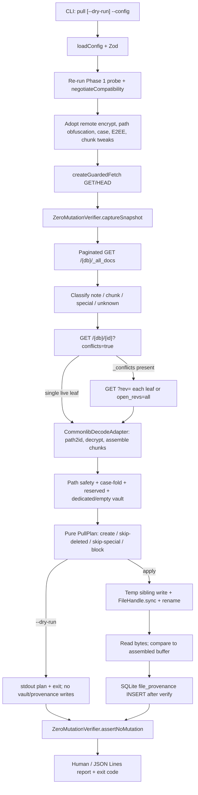

# Phase 2: Verified Pull Materialization - Research

**Researched:** 2026-09-03
**Domain:** Read-only LiveSync file decode, all-leaf remote inventory, and crash-safe vault materialization
**Confidence:** MEDIUM

<user_constraints>
## User Constraints

CONTEXT.md is absent. The user chose to continue without discuss-phase context. There are no locked user decisions for Phase 2.

Planning must honor only:

- `.planning/REQUIREMENTS.md`
- `.planning/ROADMAP.md`
- `.planning/PROJECT.md`
- Phase 1 shipped behavior and APIs

Do not invent UI research. This is a CLI/headless product.

### Locked Decisions

None from CONTEXT.md.

### the agent's Discretion

All Phase 2 implementation choices are planner/executor discretion, constrained by requirements, project constraints, and Phase 1 shipped contracts.

### Deferred Ideas (OUT OF SCOPE)

None from CONTEXT.md. Phase 3+ requirements remain out of scope even if adjacent: PULL-04 quarantine, PULL-06 resume, PULL-08 idempotent rerun, SAFE-05 full journal, CONF-07/08 write grants, SYNC-*, DAEM-*, DIST-*.
</user_constraints>

<phase_requirements>
## Phase Requirements

| ID | Description | Research Support |
|----|-------------|------------------|
| COMP-01 | Synchronize supported current and required legacy LiveSync normal-file metadata without rewriting unknown fields or special documents. | Classify only `plain`, `newnote`, and legacy `notes`. Skip chunks, markers, and unknown types. Never PUT/POST remote documents. |
| COMP-02 | Synchronize databases using supported LiveSync encryption, including current E2EE V2 and required legacy V1 reads, with authenticated decryption failures reported as blockers. | Use Commonlib `getConfiguredFunctionsForEncryption` with admission salt. Adopt remote `encrypt` / `E2EEAlgorithm` / `useDynamicIterationCount`. Fail closed on decrypt error. |
| COMP-03 | Synchronize path-obfuscated and unobfuscated records using upstream-compatible path-to-document-ID, Unicode, filename-case, and underscore rules. | Use `path2id_base` / `id2path_base`. **Lift Phase 1 negotiation blocks** that reject remote `usePathObfuscation` and `handleFilenameCaseSensitive`. |
| COMP-04 | Reconstruct text and binary files using negotiated chunk hash, splitter, size, encoding, and compression conventions. | Fetch every `children` chunk by ID, decrypt, concatenate in order, validate assembled `size`. Adopt remote `hashAlg`, `customChunkSize`, `chunkSplitterVersion`. |
| COMP-05 | Blocking error when metadata identity, decrypted content, chunk identity, assembled size, or supported document shape fails validation. | Typed blockers; do not materialize the path; do not advance provenance. |
| COMP-06 | Consider every live revision leaf rather than CouchDB's deterministic winner. | Paginated `_all_docs` + per-doc `GET ?conflicts=true` + `GET ?rev=` / `open_revs=all`. Block if any live non-deleted leaf cannot be handled. |
| PULL-01 | Finite pull-only dry-run that decodes remote state and reports planned local actions without mutating CouchDB, the vault, or synchronization provenance. | `pull --dry-run` behind GET/HEAD transport guard + `ReadCapability` only. Zero-mutation snapshot. |
| PULL-02 | Apply a verified pull to an empty or explicitly dedicated vault only after all content for each file is fetched, decrypted, assembled, and validated. | `vault.dedicated` plus emptiness check. Materialize only after the full plan is valid. |
| PULL-03 | Created or replaced local files are staged on the same filesystem, flushed, atomically installed where supported, and read back before state is committed. | Project-owned atomic reflector: temp write + `FileHandle.sync()` + `rename` + parent-dir sync where supported + read-back. Do not use Commonlib `write()` (O_TRUNC). |
| PULL-05 | Local state records the exact remote revision for each visible file only after the corresponding filesystem change is durably verified. | SQLite `file_provenance` migration 2. Commit after read-back. |
| PULL-07 | Protect from path traversal, absolute paths, unsafe symlinks, reserved state paths, and filename-case collisions. | `validateStoragePath` + Commonlib Node symlink rejection + case-fold collision preflight + reserved-name skip. |
</phase_requirements>

## Summary

Phase 2 adds a finite `pull` command that reuses Phase 1 admission, stays behind the GET/HEAD transport guard, inventories every remote document, decodes supported LiveSync file leaves through Commonlib primitives, and either prints a dry-run plan or materializes verified bytes into an empty or explicitly dedicated vault. Remote writes remain unreachable. Local provenance is written only after staged bytes are flushed, atomically installed where supported, and read back.

The compatibility path is **not** `DirectFileManipulator` as the pull coordinator. Its `enumerate()` is empty, `get()`/`getById()` return the CouchDB winner, constructor `init()` wires `SyncParamsHandler` which can PUT missing salts, and `put`/`delete`/`putSyncParameters` are write APIs. Phase 2 owns HTTP inventory and all-leaf access; Commonlib is used only for path identity, encryption transforms, and chunk assembly helpers, isolated in one adapter.

Phase 1 negotiation currently treats remote-enabled `usePathObfuscation`, `useDynamicIterationCount`, and `handleFilenameCaseSensitive` as blockers. Real LiveSync vaults use those tweaks. Phase 2 must adopt the remote values for pull instead of rejecting them.

**Primary recommendation:** Extend the Phase 1 CLI with `pull` / `--dry-run`; inventory via paginated `GET /{db}/_all_docs` then per-document `GET ?conflicts=true` and leaf bodies; decode with a Commonlib-only adapter; reflect with project-owned temp+fsync+rename; persist exact `_rev` in SQLite only after read-back.

## Architectural Responsibility Map

| Capability | Primary Tier | Secondary Tier | Rationale |
|------------|-------------|----------------|-----------|
| CLI `pull` dispatch and `--dry-run` | CLI / Application | Diagnostics formatters | Command parsing and exit codes stay in `src/cli`. |
| Re-admission and tweak adoption | API / Backend (process) | SQLite admission repo | Pull requires a successful Phase 1 probe plus adopted remote encrypt/path/case/chunk settings. |
| Read-only HTTP inventory and leaf fetch | API / Backend | Transport guard | Finite GET traversal is the COMP-06 proof. No local PouchDB replica. |
| Path/ID, decrypt, chunk assembly | Compatibility adapter | Commonlib primitives | Protocol codec is Commonlib-owned; lifecycle and fail-closed policy are project-owned. |
| Path safety, case-fold, reserved paths | Domain / Path policy | Commonlib `validateStoragePath` + Node storage | Host validates vault-relative identity before any write. |
| Dry-run plan | Domain / Reconciliation | CLI stdout | Pure function: observations → typed actions. No I/O. |
| Atomic vault reflection | Filesystem reflector | `node:fs/promises` + Commonlib `rename` | Commonlib `write()` truncates in place and is not crash-atomic. |
| Exact revision provenance | Database / Storage (`node:sqlite`) | VaultReflect capability | Provenance is process truth, never inferred from mtime. |
| Zero-mutation proof | Safety / Transport | Existing `ZeroMutationVerifier` | Dry-run and apply must leave CouchDB `update_seq` unchanged. |

## Standard Stack

Phase 2 installs **no new npm packages**. Reuse the Phase 1 pin set.

### Core

| Library | Version | Purpose | Why Standard |
|---------|---------|---------|--------------|
| Node.js | `24.20.0` LTS target (dev host currently `v24.5.0`) | Runtime, `fetch`, Web Crypto, `node:sqlite`, `node:fs/promises` | SEA/runtime pin from AGENTS.md. [VERIFIED: AGENTS.md:50] |
| TypeScript | `5.9.3` | Language | Upstream-aligned. [VERIFIED: package.json:24] |
| `@vrtmrz/livesync-commonlib` | `0.1.21` exact | Path/ID, encryption transforms, document types, rooted storage `rename`/`validateStoragePath` | Pinned LiveSync 1.0.23 artefact. [VERIFIED: package.json:15] |
| `node:sqlite` | Node built-in | Admission + new `file_provenance` | Already shipped. [VERIFIED: src/storage/sqlite.ts:1-5] |
| `zod` | `4.5.4` | Config (`vault.dedicated`) | Already shipped. [VERIFIED: package.json:17] |
| `yaml` | `2.9.0` | Config parse | Already shipped. [VERIFIED: package.json:16] |
| `node:util.parseArgs` | Node built-in | Add `pull` and `--dry-run` | Already shipped. [VERIFIED: src/cli/index.ts:1] |
| Web `fetch` + `createGuardedFetch` | Phase 1 | GET/HEAD only | Keep pull on the same allowlist. [VERIFIED: src/security/transport-guard.ts:6] |

### Supporting

| Library | Version | Purpose | When to Use |
|---------|---------|---------|-------------|
| Vitest | `4.1.11` | Unit, characterization, integration | Serial (`fileParallelism: false`). [VERIFIED: vitest.config.ts:8] |
| `@testcontainers/couchdb` | `12.1.0` | Real CouchDB 3.5.2.1 | Seed notes/chunks/conflicts; never user DBs. [VERIFIED: tests/integration/couchdb-harness.ts:16] |
| `@vrtmrz/livesync-commonlib/node` | `0.1.21` | `createNodeStorage`, `validateStoragePath`, `rename` | Path rooting and atomic rename only — not `write()`. |
| `octagonal-wheels` | transitive via Commonlib | Already used by `src/livesync/syncinfo.ts` | Keep decrypt characterization consistent. |

### Alternatives Considered

| Instead of | Could Use | Tradeoff |
|------------|-----------|----------|
| Project-owned GET inventory + Commonlib decode adapter | `DirectFileManipulator` as pull engine | DFM `enumerate()` is empty; `get` is winner-only; `init()` can PUT sync params. Reject for Phase 2 coordination. |
| HTTP-only CouchDB | Local PouchDB/LevelDB replica | ARCHITECTURE.md preferred a replica; STACK.md forbids LevelDB for SEA. Phase 1 already proved HTTP GET. Stay HTTP-only. |
| Commonlib `NodeStorageAdapter.write()` | Project atomic reflector | `write()` uses `O_TRUNC` on the destination. Unsafe for PULL-03. |
| `write-file-atomic` npm package | `node:fs/promises` temp + `sync` + `rename` | No new packages; Node APIs are sufficient. |
| CouchDB `_index` / Mango `_find` for conflicts | Per-doc `GET ?conflicts=true` | `_index` is denylisted (`/_index` in transport guard). |

**Installation:** none. Do not run `npm install` for Phase 2.

**Version verification (already pinned, re-checked this session):** `package.json` declares `"@vrtmrz/livesync-commonlib": "0.1.21"`, `"yaml": "2.9.0"`, `"zod": "4.5.4"`, `"vitest": "4.1.11"`, `"@testcontainers/couchdb": "12.1.0"`. [VERIFIED: package.json:14-25]

## Package Legitimacy Audit

No Phase 2 package installs. Legitimacy gate was run against already-installed pins:

| Package | Registry | Age signal | Downloads | Source Repo | Verdict | Disposition |
|---------|----------|------------|-----------|-------------|---------|-------------|
| `@vrtmrz/livesync-commonlib` | npm | flagged too-new | 3,737/wk | github.com/vrtmrz/livesync-commonlib | SUS (too-new) | Already installed in Phase 1 — do not reinstall |
| `yaml` | npm | established | 202M/wk | github.com/eemeli/yaml | OK | Already installed |
| `zod` | npm | flagged too-new (current 4.x publish) | 274M/wk | github.com/colinhacks/zod | SUS (too-new) | Already installed in Phase 1 — do not reinstall |
| `vitest` | npm | flagged too-new (current 4.x publish) | 99M/wk | github.com/vitest-dev/vitest | SUS (too-new) | Already installed in Phase 1 — do not reinstall |

**Packages removed due to [SLOP] verdict:** none
**Packages flagged as suspicious [SUS]:** none new. Planner must not add a `checkpoint:human-verify` install task because Phase 2 installs nothing.

## Architecture Patterns

### System Architecture Diagram



### Recommended Project Structure

```text
src/
├── cli/
│   ├── index.ts                    # add pull + --dry-run
│   └── commands/
│       ├── inspect.ts              # unchanged coordinator
│       └── pull.ts                 # NEW pull coordinator
├── livesync/
│   ├── inspector.ts                # extend with all-docs + leaf fetch
│   ├── negotiation.ts              # adopt remote incompatible tweaks for pull
│   ├── inventory.ts                # NEW finite remote inventory
│   ├── decode-adapter.ts           # NEW Commonlib isolation boundary
│   └── zero-mutation.ts            # reuse
├── domain/
│   ├── pull-plan.ts                # NEW pure planner
│   └── path-policy.ts              # NEW vault-relative + case-fold
├── filesystem/
│   ├── atomic-reflector.ts         # NEW temp+sync+rename+readback
│   └── vault-preflight.ts          # NEW empty/dedicated + collision scan
├── storage/
│   ├── sqlite.ts                   # migration 2
│   ├── admission-repo.ts           # reuse
│   └── provenance-repo.ts          # NEW
├── security/
│   ├── transport-guard.ts          # unchanged GET/HEAD
│   └── capabilities.ts             # add VaultReflectCapability
tests/
├── unit/
│   ├── pull-plan.test.ts
│   ├── path-policy.test.ts
│   ├── atomic-reflector.test.ts
│   ├── provenance-repo.test.ts
│   └── negotiation.test.ts         # extend adoption cases
├── characterization/
│   ├── commonlib-path.test.ts
│   ├── commonlib-decode.test.ts
│   └── commonlib-enumerate-ranges.test.ts
└── integration/
    ├── pull-dry-run.test.ts
    └── pull-apply.test.ts
```

### Pattern 1: Finite all-leaf inventory (do not trust `_all_docs` conflicts)

**What:** Paginate `GET /{db}/_all_docs`, then `GET /{db}/{id}?conflicts=true` for every candidate note. If `_conflicts` is non-empty, fetch each leaf body with `GET /{db}/{id}?rev={rev}` or one `GET ?open_revs=all`.
**When to use:** Every pull, including dry-run.

Official CouchDB 3.5: default GET returns the winner only; `conflicts=true` adds other leaf rev IDs; `open_revs=all` returns all leaves including deleted ones; `_all_docs?include_docs=true&conflicts=true` does **not** populate `_conflicts` on the embedded doc. [CITED: docs.couchdb.org/en/stable/replication/conflicts.html]

Do not create `_index` or `_design` views to find conflicts — those paths are denylisted. [VERIFIED: src/security/transport-guard.ts:9-22]

```
'/ _purge', '/_compact', '/_security', '/_revs_limit', '/_replicator', '/_design', '/_index', '/_node', '/_users', '/_config', '/_restart', '/_up'
```

### Pattern 2: Adopt remote tweaks for pull, do not reject them

Phase 1 `negotiateCompatibility` blocks when remote incompatible tweaks are truthy, except `encrypt` which is compared to local config. [VERIFIED: src/livesync/negotiation.ts:108-128]

```
        if (remoteVal) {
          blockers.push({
            code: 'INCOMPATIBLE_TWEAK',
            message: `Incompatible difference for '${key}': remote=${remoteVal}`,
            suggestion: `The '${key}' LiveSync tweak is not currently supported in this headless release`,
          });
        }
```

Commonlib `IncompatibleChanges` means two clients must not *disagree*; it does not mean the headless client may ignore the remote value. [VERIFIED: node_modules/@vrtmrz/livesync-commonlib/dist/common/models/tweak.definition.js:23-29]

```
const IncompatibleChanges = [
  "encrypt",
  "usePathObfuscation",
  "useDynamicIterationCount",
  "handleFilenameCaseSensitive"
];
const CompatibleButLossyChanges = ["hashAlg", "customChunkSize", "chunkSplitterVersion"];
```

**Use:** adopt remote values into `negotiatedSettings` for pull decode. Keep blocking only when local `encryption.enabled` disagrees with remote `encrypt`.

### Pattern 3: Capability-gated apply

Dry-run takes `ReadCapability` only. Apply additionally requires a new `VaultReflectCapability` issued after admission + empty/dedicated preflight. Do not pass `boolean canWrite`.

Phase 1 shipped only `ReadCapability` and `AdmissionCapability`. [VERIFIED: src/security/capabilities.ts:1-18]

```
const ReadCapabilityBrand = Symbol('ReadCapability');
const AdmissionCapabilityBrand = Symbol('AdmissionCapability');
```

### Pattern 4: Provenance after bytes

Commonlib provenance contract: `path -> { revision, observedStorageMtime? }`; revision is authoritative; update only after successful reflection. [VERIFIED: node_modules/@vrtmrz/livesync-commonlib/dist/interfaces/FileReflectionProvenance.d.ts:3-8]

```
export type FileReflectionProvenanceRecord = {
    /** Exact database revision which most recently produced the storage state. */
    revision: string;
    /** Raw modification time observed from this device's storage after reflection. */
    observedStorageMtime?: number;
};
```

Implement with project SQLite, not Commonlib `StoredFileReflectionProvenance` (that needs a Commonlib `SimpleStore`). Current schema version is `1`. [VERIFIED: src/storage/sqlite.ts:5]

```
export const CURRENT_SCHEMA_VERSION = 1;
```

### Anti-Patterns to Avoid

- **Construct `DirectFileManipulator` for pull:** constructor calls `void this.init()`; encryption init uses `createSyncParamsHanderForServer` which PUTs when params/salt are missing. [VERIFIED: node_modules/@vrtmrz/livesync-commonlib/dist/API/DirectFileManipulatorV2.js:76-101] [VERIFIED: node_modules/@vrtmrz/livesync-commonlib/dist/replication/SyncParamsHandler.js:37-40]
- **Call `enumerate()`:** empty untested generator. [VERIFIED: node_modules/@vrtmrz/livesync-commonlib/dist/API/DirectFileManipulatorV2.js:307-309]
- **Trust `_all_docs?include_docs=true&conflicts=true` for leaves.** Official conflicts chapter shows the embedded `doc` without `_conflicts`. [CITED: docs.couchdb.org/en/stable/replication/conflicts.html]
- **Materialize the CouchDB winner when `_conflicts` is non-empty.** Block the path (COMP-06 / PULL success criterion 3). Automatic collapse is Phase 4 (SYNC-06).
- **Use `NodeStorageAdapter.write()` for vault files.** It opens with `O_TRUNC`. [VERIFIED: node_modules/@vrtmrz/livesync-commonlib/dist/platform/node/storage.js:139-141]
- **Write provenance before read-back.**
- **Create CouchDB indexes, design docs, or a local LevelDB replica.**
- **Quarantine, resume checkpoints, or overwrite divergent existing files.** Those are Phase 3.

## Don't Hand-Roll

| Problem | Don't Build | Use Instead | Why |
|---------|-------------|-------------|-----|
| Path → document ID, underscore escape, obfuscation hash | Custom SHA/path rules | `path2id_base` / `id2path_base` from Commonlib path module, isolated in `decode-adapter.ts` | Obfuscated IDs use `f:` + hashed passphrase; leading `_` becomes `/_`. [VERIFIED: node_modules/@vrtmrz/livesync-commonlib/dist/string_and_binary/path.js:77-93] |
| Vault-relative path rejection | Ad-hoc `includes('..')` | `validateStoragePath` | Rejects absolute, drive-letter, backslash, `.` / `..`. [VERIFIED: node_modules/@vrtmrz/livesync-commonlib/dist/platform/storagePath.js:1-17] |
| E2EE V1/V2 document/chunk decrypt | Custom AES | `getConfiguredFunctionsForEncryption` incoming transform; salt from already-fetched sync params only | Same transforms DFM uses, without constructing DFM. [VERIFIED: node_modules/@vrtmrz/livesync-commonlib/dist/pouchdb/encryption.d.ts:9-13] |
| Document type constants | String literals invented in app code | `EntryTypes`, `NoteTypes`, `PREFIX_*` from Commonlib | Historic IDs and types must match clients. [VERIFIED: node_modules/@vrtmrz/livesync-commonlib/dist/common/models/db.const.js:5-18] |
| Atomic rename after staging | Copy+unlink | `fsPromises.rename` or Commonlib `rename()` | POSIX same-filesystem replace. [CITED: nodejs.org/download/release/v24.20.0/docs/api/fs.html] |
| Durable flush | Trust `writeFile` promise | `FileHandle.sync()` | Official Node 24 fsync wrapper. [CITED: nodejs.org/download/release/v24.20.0/docs/api/fs.html#filehandlesync] |
| YAML/Zod/SQLite/CLI parse | New libraries | Phase 1 modules | Already shipped. |

**Key insight:** Compatibility is a codec problem; safety is a lifecycle problem. Reuse Commonlib for the codec. Own inventory, leaf policy, atomic install, and provenance commit.

## Common Pitfalls

### Pitfall 1: Winner-only pull hides conflict branches
**What goes wrong:** Vault shows one file; another live leaf is never examined.
**Why it happens:** Default CouchDB GET and DFM `get`/`getById` return the deterministic winner. [CITED: docs.couchdb.org/en/stable/replication/conflicts.html] [VERIFIED: node_modules/@vrtmrz/livesync-commonlib/dist/API/DirectFileManipulatorV2.js:223-243]
**How to avoid:** Always `GET ?conflicts=true`. If `_conflicts` is non-empty, fetch every live non-deleted leaf and **block** the path.
**Warning signs:** Tests only seed a single revision; no `_conflicts` fixture.

### Pitfall 2: `_all_docs` `conflicts=true` looks sufficient
**What goes wrong:** Inventory thinks there are no conflicts.
**Why it happens:** Official docs: `conflicts=true` is ignored on view/`include_docs` embedded docs. [CITED: docs.couchdb.org/en/stable/replication/conflicts.html]
**How to avoid:** Second hop per note document.
**Warning signs:** A single HTTP call is used for both listing and conflict detection.

### Pitfall 3: DFM or SyncParamsHandler mutates during "read"
**What goes wrong:** Missing salt causes PUT of `_local/obsidian_livesync_sync_parameters`.
**Why it happens:** `createSyncParamsHandler` creates and `put`s when get throws `SyncParamsNotFoundError`. [VERIFIED: node_modules/@vrtmrz/livesync-commonlib/dist/replication/SyncParamsHandler.js:37-40]
**How to avoid:** Do not construct DFM. Inject admission salt into Commonlib decrypt. Keep transport GET/HEAD.
**Warning signs:** `update_seq` changes during pull; `MutationAttemptBlockedError` on PUT.

### Pitfall 4: In-place truncate then crash
**What goes wrong:** Zero-byte vault file looks like a user edit later.
**Why it happens:** Commonlib `writeFile` uses `O_TRUNC`. [VERIFIED: node_modules/@vrtmrz/livesync-commonlib/dist/platform/node/storage.js:139-141]
**How to avoid:** Sibling temp file, `sync`, `rename`, parent-dir `sync` where supported, read-back.
**Warning signs:** Destination opened with `'w'` / `O_TRUNC`.

### Pitfall 5: Provenance before verified bytes
**What goes wrong:** Restart treats a missing/partial file as already pulled.
**How to avoid:** Order: durable bytes → visible rename → read-back match → SQLite commit.
**Warning signs:** `saveProvenance` called from the planner.

### Pitfall 6: Phase 1 negotiation rejects real vaults
**What goes wrong:** Encrypted+obfuscated databases never reach pull.
**Why it happens:** Phase 1 pushes `INCOMPATIBLE_TWEAK` when remote path/case/dynamic-iteration is truthy. [VERIFIED: src/livesync/negotiation.ts:119-128]
**How to avoid:** Adopt those remote values for decode.
**Warning signs:** `INCOMPATIBLE` exit 3 on a healthy LiveSync DB that `inspect` already understood except for those tweaks.

### Pitfall 7: Obfuscated path decoded from `_id`
**What goes wrong:** `id2path_base` throws `Entry has been obfuscated!` if `entry.path` is missing. [VERIFIED: node_modules/@vrtmrz/livesync-commonlib/dist/string_and_binary/path.js:95-101]
**How to avoid:** After decrypt, use document `path`; verify `path2id_base(path) === _id`.
**Warning signs:** Filenames like `f:ab12…` appear in the vault.

### Pitfall 8: Assembling before all chunks exist
**What goes wrong:** Truncated file accepted as success.
**How to avoid:** Fetch every `children` ID; missing chunk is a blocker, not a zero-byte file. Do not advance that path.
**Warning signs:** Materialize starts from metadata alone.

### Pitfall 9: Treating LiveSync `deleted` as CouchDB `_deleted`
**What goes wrong:** Logical deletions rematerialize, or tombstones are decrypted as files.
**How to avoid:** Skip materialization when metadata `deleted === true`. Replicate-read `_deleted` tombstones without decrypt. Do not DELETE remotely.
**Warning signs:** `db.remove` or HTTP DELETE in pull code.

### Pitfall 10: Case-fold collision on Linux
**What goes wrong:** Two remote paths fold to one local name when `handleFilenameCaseSensitive` is false.
**How to avoid:** Preflight case-folded map; block both paths; do not pick a winner.
**Warning signs:** `A.md` and `a.md` both planned as creates.

## Code Examples

### CLI surface to extend

[VERIFIED: src/cli/index.ts:19-28]

```
export const CLI_HELP = `obsidian-livesync-headless [command] [options]

Commands:
  inspect                     Safely inspect and negotiate compatibility with CouchDB

Options:
  -c, --config <path>         Path to YAML configuration file
      --json                  Output structured JSON Lines report
  -h, --help                  Show help and usage information
  -v, --version               Show version information
`;
```

Add command `pull` and option `--dry-run`. Keep `inspect` default when command is omitted. [VERIFIED: src/cli/index.ts:90]

```
    const isInspect = !parsed.command || parsed.command === 'inspect';
```

### Outcome categories — add CONFLICT

[VERIFIED: src/diagnostics/outcomes.ts:1-23]

```
export const OutcomeCategory = {
  SUCCESS: 'SUCCESS',
  CONFIG_ERROR: 'CONFIG_ERROR',
  AUTHENTICATION_ERROR: 'AUTHENTICATION_ERROR',
  INCOMPATIBLE: 'INCOMPATIBLE',
  NOT_FOUND: 'NOT_FOUND',
  TRANSIENT_OUTAGE: 'TRANSIENT_OUTAGE',
  MUTATION_VIOLATION: 'MUTATION_VIOLATION',
  CORRUPTION: 'CORRUPTION',
} as const;

export const EXIT_CODES: Record<OutcomeCategory, number> = {
  SUCCESS: 0,
  CONFIG_ERROR: 1,
  AUTHENTICATION_ERROR: 2,
  INCOMPATIBLE: 3,
  NOT_FOUND: 4,
  TRANSIENT_OUTAGE: 5,
  MUTATION_VIOLATION: 6,
  CORRUPTION: 7,
};
```

Add `CONFLICT: 'CONFLICT'` and `CONFLICT: 8`. Do not reuse `CORRUPTION` for unresolved leaves. SAFE-06 lists conflict as its own category.

### Vault config — add dedicated

[VERIFIED: src/config/schema.ts:36-40]

```
export const VaultConfigSchema = z
  .object({
    path: z.string().min(1),
  })
  .strict();
```

Add `dedicated: z.boolean().default(false)`. When `false`, vault must contain zero files. When `true`, existing files without provenance block those paths (no overwrite; quarantine is Phase 3).

### Document types and ID prefixes

[VERIFIED: node_modules/@vrtmrz/livesync-commonlib/dist/common/models/db.const.js:5-18]

```
const EntryTypes = {
  NOTE_LEGACY: "notes",
  NOTE_BINARY: "newnote",
  NOTE_PLAIN: "plain",
  INTERNAL_FILE: "internalfile",
  CHUNK: "leaf",
  CHUNK_PACK: "chunkpack",
  VERSION_INFO: "versioninfo",
  SYNC_INFO: "syncinfo",
  SYNC_PARAMETERS: "sync-parameters",
  MILESTONE_INFO: "milestoneinfo",
  NODE_INFO: "nodeinfo"
};
const NoteTypes = [EntryTypes.NOTE_LEGACY, EntryTypes.NOTE_BINARY, EntryTypes.NOTE_PLAIN];
```

[VERIFIED: node_modules/@vrtmrz/livesync-commonlib/dist/common/models/shared.const.behabiour.js:12-19]

```
const IDPrefixes = {
  Obfuscated: "f:",
  Chunk: "h:",
  EncryptedChunk: "h:+"
};
const PREFIX_OBFUSCATED = "f:";
const PREFIX_CHUNK = "h:";
const PREFIX_ENCRYPTED_CHUNK = "h:+";
```

DFM's working enumerator skips those reserved ID ranges rather than using empty `enumerate()`:

[VERIFIED: node_modules/@vrtmrz/livesync-commonlib/dist/API/DirectFileManipulatorV2.js:316-323]

```
    const targets = [
      this._enumerate("", "h:", opt),
      this._enumerate(`h:\u{10FFFF}`, "i:", opt),
      this._enumerate(`i:\u{10FFFF}`, "ix:", opt),
      this._enumerate(`ix:\u{10FFFF}`, "ps:", opt),
      this._enumerate(`ps:\u{10FFFF}`, "\u{10FFFF}", opt)
    ];
```

Use the same skip ranges when classifying `_all_docs` rows. Do not call `enumerate()`.

### E2EE algorithms

[VERIFIED: node_modules/@vrtmrz/livesync-commonlib/dist/common/models/setting.const.js:22-31]

```
const E2EEAlgorithmNames = {
  "": "V1: Legacy",
  v2: "V2: AES-256-GCM With HKDF",
  forceV1: "Force-V1: Force Legacy (Not recommended)"
};
const E2EEAlgorithms = {
  V1: "",
  V2: "v2",
  ForceV1: "forceV1"
};
```

Support `""` and `"v2"` reads. Treat unknown algorithm strings as `INCOMPATIBLE`.

### Reserved vault names to skip

[VERIFIED: node_modules/@vrtmrz/livesync-commonlib/dist/common/models/redflag.const.js:3-16]

```
const FlagFilesOriginal = {
  SUSPEND_ALL: "redflag.md",
  REBUILD_ALL: "redflag2.md",
  FETCH_ALL: "redflag3.md"
};
const FlagFilesHumanReadable = {
  REBUILD_ALL: "flag_rebuild.md",
  FETCH_ALL: "flag_fetch.md"
};
```

Also skip `livesync_log_` / `LIVESYNC_LOG_` prefixes via `shouldBeIgnored`. [VERIFIED: node_modules/@vrtmrz/livesync-commonlib/dist/string_and_binary/path.js:121-143]

### Path2id (verbatim algorithm to wrap, not reimplement)

[VERIFIED: node_modules/@vrtmrz/livesync-commonlib/dist/string_and_binary/path.js:77-93]

```
async function path2id_base(filenameSrc, obfuscatePassphrase, caseInsensitive) {
  if (filenameSrc.startsWith(PREFIX_OBFUSCATED)) return `${filenameSrc}`;
  let filename = `${filenameSrc}`;
  const newPrefix = obfuscatePassphrase ? PREFIX_OBFUSCATED : "";
  if (caseInsensitive) {
    filename = filename.toLowerCase();
  }
  let x = filename;
  if (x.startsWith("_")) x = "/" + x;
  if (!obfuscatePassphrase) {
    return newPrefix + x;
  }
  const [prefix, body] = expandFilePathPrefix(x);
  if (body.startsWith(PREFIX_OBFUSCATED)) return newPrefix + x;
  const hashedPassphrase = await hashString(obfuscatePassphrase);
  const out = await hashString(`${hashedPassphrase}:${filename}`);
  return prefix + newPrefix + out;
}
```

### validateStoragePath

[VERIFIED: node_modules/@vrtmrz/livesync-commonlib/dist/platform/storagePath.js:6-16]

```
  if (storagePath.startsWith("/") || storagePath.startsWith("\\") || /^[A-Za-z]:/.test(storagePath)) {
    throw new Error(`Storage paths must be relative to the configured root: ${storagePath}`);
  }
  if (storagePath.includes("\\")) {
    throw new Error(`Storage paths must use forward slashes: ${storagePath}`);
  }
  const segments = storagePath.split("/");
  if (segments.some((segment) => segment === "." || segment === "..")) {
    throw new Error(`Storage paths must not contain traversal segments: ${storagePath}`);
  }
```

### Atomic install (project-owned; Node 24)

```ts
// Source: https://nodejs.org/download/release/v24.20.0/docs/api/fs.html (FileHandle.sync, fsPromises.rename)
import { open, rename } from 'node:fs/promises';
import { join, dirname } from 'node:path';
import { randomBytes } from 'node:crypto';

export async function installAtomically(
  vaultRoot: string,
  relativePath: string, // already validateStoragePath'd
  bytes: Uint8Array
): Promise<void> {
  const dest = join(vaultRoot, relativePath);
  const tmp = join(dirname(dest), `.ols-tmp-${randomBytes(8).toString('hex')}`);
  const handle = await open(tmp, 'wx');
  try {
    await handle.writeFile(bytes);
    await handle.sync();
  } finally {
    await handle.close();
  }
  await rename(tmp, dest);
  try {
    const dir = await open(dirname(dest), 'r');
    try {
      await dir.sync();
    } finally {
      await dir.close();
    }
  } catch {
    // Parent-dir sync is best-effort ("where supported"). File sync + rename + read-back remain required.
  }
}
```

`filehandle.sync()`: "Request that all data for the open file descriptor is flushed to the storage device." [CITED: nodejs.org/download/release/v24.20.0/docs/api/fs.html]

### Pull plan types (project-owned)

```ts
export type PullAction =
  | { kind: 'create'; path: string; sourceRevision: string; bytes: Uint8Array }
  | { kind: 'skip-logical-delete'; path: string; sourceRevision: string }
  | { kind: 'skip-special'; id: string; type: string }
  | { kind: 'skip-ignored'; path: string }
  | { kind: 'block'; path?: string; id: string; code: string; message: string };
```

Dry-run serializes these without `bytes` (report size/hash only; never decrypted payload in logs).

### SQLite provenance migration

```sql
CREATE TABLE IF NOT EXISTS file_provenance (
  path TEXT PRIMARY KEY,
  remote_revision TEXT NOT NULL,
  content_sha256 TEXT NOT NULL,
  observed_mtime INTEGER,
  remote_fingerprint TEXT NOT NULL,
  reflected_at TEXT NOT NULL
);
```

No passphrase, Authorization, or plaintext file body columns.

## State of the Art

| Old Approach | Current Approach | When Changed | Impact |
|--------------|------------------|--------------|--------|
| DFM / local PouchDB pull then reflect | Project-owned GET inventory + Commonlib codec + atomic reflector | Phase 1 shipped HTTP admission; STACK forbids LevelDB | Matches Phase 1 transport guard and SEA constraint |
| `NodeStorageAdapter.write()` | Temp + `FileHandle.sync` + `rename` | Commonlib storage contract documents in-place write | Satisfies PULL-03 |
| Treat `_all_docs&conflicts=true` as all-leaf | Per-document `?conflicts=true` | CouchDB 3.x conflicts chapter | COMP-06 is actually testable |
| Phase 1 reject remote path/case tweaks | Adopt remote incompatible tweaks for pull | Phase 2 | Real obfuscated vaults become pullable |

**Deprecated/outdated:**

- `DirectFileManipulator.enumerate()` — empty, untested. [VERIFIED: node_modules/@vrtmrz/livesync-commonlib/dist/API/DirectFileManipulatorV2.js:307-309]
- Local LevelDB replica as Phase 2 prerequisite — rejected by STACK/SEA.
- Creating CouchDB `_index` to find conflicts — SAFE-01 / transport denylist.

## Assumptions Log

| # | Claim | Section | Risk if Wrong |
|---|-------|---------|---------------|
| A1 | Parent-directory `fsync` may fail on some Docker/ZFS bind mounts; file `sync` + rename + read-back is still sufficient to meet PULL-03 "where supported". | Atomic reflector | Planner should treat dir-sync failure as warning, not hard fail, unless tests show rename is also unreliable on the target FS. |
| A2 | Phase 2 may add `CONFLICT` exit code `8` without breaking Phase 1 tests that only assert 0–7. | Outcomes | If an existing test iterates all `EXIT_CODES` keys, update it. |
| A3 | `vault.dedicated` default `false` is the correct operator default (empty vault required). | Config | Operators with a pre-created empty dataset still pass; non-empty vaults need the flag. |

## Open Questions (RESOLVED)

1. **Should a single unresolved conflict fail the whole pull or only that path?**
   - What we know: Success criterion 3 requires a blocking diagnostic; Phase 3 owns resume.
   - What's unclear: Whether other valid files may still be applied in the same apply run.
   - RESOLVED: Fail-closed for apply — if any `block` action exists after planning, apply nothing and exit `CONFLICT` or `CORRUPTION` as appropriate. Dry-run still lists the full plan. This avoids a half-materialized vault that Phase 3 would have to resume.

2. **How much legacy `notes` (inline `data`) vs chunked `plain`/`newnote` must fixtures cover?**
   - What we know: `NoteTypes` includes `notes`, `newnote`, `plain`.
   - RESOLVED: Characterization fixtures for all three; integration seeds at least `plain` text and `newnote` binary, plus one `notes` legacy body.

3. **Obfuscation passphrase vs E2EE passphrase**
   - What we know: DFM options have both `passphrase` and `obfuscatePassphrase`. Phase 1 config has a single `encryption.passphrase`.
   - RESOLVED: Use the same resolved `encryptionPassphrase` for both decrypt and `path2id_base` obfuscation unless a future config key is added. Document this in the pull report's adopted tweaks.

## Environment Availability

| Dependency | Required By | Available | Version | Fallback |
|------------|------------|-----------|---------|----------|
| Node.js | Runtime / `node:sqlite` / `FileHandle.sync` | ✓ | v24.5.0 (meets >=24) | Use installed Node for tests; SEA remains 24.20.0 later |
| npm | Existing lockfile | ✓ | 11.9.0 | — |
| Docker | Testcontainers CouchDB | ✓ | 29.7.2 | — |
| `couchdb:3.5.2.1` image | Integration | ✓ | ID `f1dc96c1aa5f` | Cached locally |
| `node:sqlite` | Provenance | ✓ | built-in (experimental warning) | Already used in Phase 1 |
| Context7 CLI | Research seam | ✗ | — | Official docs via WebFetch (done) |
| Knowledge graph | Cross-doc discovery | ✗ | — | Manual file reads (done) |

**Missing dependencies with no fallback:** none for execution.

**Missing dependencies with fallback:** Context7 (used official CouchDB/Node docs + unpacked Commonlib 0.1.21).

## Validation Architecture

### Test Framework

| Property | Value |
|----------|-------|
| Framework | Vitest `4.1.11` [VERIFIED: package.json:25] |
| Config file | `vitest.config.ts` (`environment: 'node'`, `fileParallelism: false`, `include: ['tests/**/*.test.ts']`) [VERIFIED: vitest.config.ts:3-10] |
| Quick run command | `npx vitest run tests/unit tests/characterization` |
| Full suite command | `npx vitest run` |

### Phase Requirements → Test Map

| Req ID | Behavior | Test Type | Automated Command | File Exists? |
|--------|----------|-----------|-------------------|-------------|
| COMP-01 | Classify note vs special vs unknown; never rewrite remote | unit + characterization | `npx vitest run tests/unit/pull-plan.test.ts tests/characterization/commonlib-enumerate-ranges.test.ts` | ❌ Wave 0 |
| COMP-02 | V2 HKDF and V1 decrypt; wrong passphrase blocks | characterization + integration | `npx vitest run tests/characterization/commonlib-decode.test.ts tests/characterization/commonlib-crypto.test.ts` | ❌ Wave 0 (crypto exists for syncinfo only) |
| COMP-03 | Obfuscated and plain path2id; underscore; case fold | characterization | `npx vitest run tests/characterization/commonlib-path.test.ts` | ❌ Wave 0 |
| COMP-04 | Chunk assemble + size check for text/binary | characterization + integration | `npx vitest run tests/characterization/commonlib-decode.test.ts tests/integration/pull-apply.test.ts` | ❌ Wave 0 |
| COMP-05 | Identity/decrypt/chunk/size/shape failures block | unit | `npx vitest run tests/unit/pull-plan.test.ts` | ❌ Wave 0 |
| COMP-06 | Two live leaves → block; winner not materialized | integration | `npx vitest run tests/integration/pull-apply.test.ts` | ❌ Wave 0 |
| PULL-01 | `--dry-run` no vault/provenance/CouchDB mutation | integration | `npx vitest run tests/integration/pull-dry-run.test.ts` | ❌ Wave 0 |
| PULL-02 | Empty/dedicated gate; assemble-before-write | unit + integration | `npx vitest run tests/unit/vault-preflight.test.ts tests/integration/pull-apply.test.ts` | ❌ Wave 0 |
| PULL-03 | Temp+sync+rename+readback; crash-before-rename leaves dest untouched | unit | `npx vitest run tests/unit/atomic-reflector.test.ts` | ❌ Wave 0 |
| PULL-05 | Provenance only after verify; dry-run writes none | unit + integration | `npx vitest run tests/unit/provenance-repo.test.ts tests/integration/pull-apply.test.ts` | ❌ Wave 0 |
| PULL-07 | Traversal, absolute, symlink, reserved, case collision | unit | `npx vitest run tests/unit/path-policy.test.ts` | ❌ Wave 0 |

### Sampling Rate

- **Per task commit:** `npx vitest run tests/unit tests/characterization`
- **Per wave merge:** `npx vitest run`
- **Phase gate:** Full suite green before `$gsd-verify-work`, including Testcontainers pull tests and zero-mutation assertions

### Wave 0 Gaps

- [ ] `tests/unit/pull-plan.test.ts` — COMP-01/05, PULL-01 plan shapes
- [ ] `tests/unit/path-policy.test.ts` — PULL-07
- [ ] `tests/unit/atomic-reflector.test.ts` — PULL-03
- [ ] `tests/unit/provenance-repo.test.ts` — PULL-05
- [ ] `tests/unit/vault-preflight.test.ts` — PULL-02 empty/dedicated
- [ ] `tests/characterization/commonlib-path.test.ts` — COMP-03
- [ ] `tests/characterization/commonlib-decode.test.ts` — COMP-02/04
- [ ] `tests/characterization/commonlib-enumerate-ranges.test.ts` — reserved ID prefixes
- [ ] `tests/integration/pull-dry-run.test.ts` — PULL-01 + zero mutation
- [ ] `tests/integration/pull-apply.test.ts` — PULL-02/03/05, COMP-06 conflict seed
- [ ] Extend `tests/unit/negotiation.test.ts` for tweak adoption
- [ ] Extend `tests/integration/couchdb-harness.ts` with conflict-leaf and chunk seed helpers
- [ ] Framework install: none — Vitest already present

## Security Domain

`workflow.security_enforcement` is `true` (ASVS level 1). [VERIFIED: .planning/config.json:47-49]

### Applicable ASVS Categories

| ASVS Category | Applies | Standard Control |
|---------------|---------|-----------------|
| V2 Authentication | yes | Existing Basic auth headers; passphrase from env/file; never persist |
| V3 Session Management | no | No user sessions |
| V4 Access Control | yes | GET/HEAD allowlist; VaultReflect capability; no admin endpoints |
| V5 Input Validation | yes | Zod config; `validateStoragePath`; document-shape classification |
| V6 Cryptography | yes | Commonlib `getConfiguredFunctionsForEncryption` — never hand-roll AES |
| V8 Data Protection | yes | Redact secrets; no decrypted payloads in logs/SQLite |
| V12 File and Resources | yes | Rooted paths, symlink reject, reserved state path, case-fold collisions |
| V14 Configuration | yes | Strict YAML; `vault.dedicated` explicit |

### Known Threat Patterns for LiveSync pull

| Pattern | STRIDE | Standard Mitigation |
|---------|--------|---------------------|
| Remote mutation during pull | Tampering | GET/HEAD transport guard + zero-mutation snapshots |
| Path traversal / symlink escape | Elevation of Privilege | `validateStoragePath` + `O_NOFOLLOW` / lstat symlink checks |
| Overwrite of unproven local files | Tampering | Empty/dedicated preflight; no overwrite this phase |
| Decrypt failure treated as missing | Information Disclosure / Tampering | Authenticated decrypt errors → blocker, preserve ciphertext remotely |
| Conflict winner silently chosen | Tampering | All-leaf fetch + block |
| Secret leakage in pull report | Information Disclosure | Existing `SecretRedactor`; never log assembled bytes or passphrases |
| Index/design-doc creation "to find conflicts" | Elevation of Privilege | Transport denylist `_index` / `_design` |

## Project Constraints (from AGENTS.md)

Treat these with the same authority as locked decisions:

- Compatibility: current Obsidian Self-hosted LiveSync CouchDB data is the de-facto standard. [VERIFIED: AGENTS.md:15]
- Data safety: preserve unknown and conflicting content; require proven ancestry before automatic conflict resolution. [VERIFIED: AGENTS.md:16]
- Remote safety: no drop, reset, purge, rebuild, compaction, or GC. [VERIFIED: AGENTS.md:17]
- Bootstrap safety: inspect/negotiate before writes to an existing database. Phase 2 still has **no remote writes**. [VERIFIED: AGENTS.md:18]
- Scope: LiveSync preset + CouchDB only. [VERIFIED: AGENTS.md:19]
- Packaging: single CLI executable later; avoid native addons and extra runtime files now. [VERIFIED: AGENTS.md:20]
- Secrets: runtime/env only; redact everywhere. [VERIFIED: AGENTS.md:21]
- Commonlib `0.1.21` exact; do not resolve `@latest`. [VERIFIED: AGENTS.md:53]
- Prefer `DirectFileManipulator` for file ops **but wrap it**; Phase 2 wrapping means: do not use it as coordinator because enumeration/conflicts/init writes are unsafe. Use path/encrypt primitives instead. [VERIFIED: AGENTS.md:62]
- `@vrtmrz/livesync-commonlib/node`: compose temp-write plus `rename()`; direct `write()` truncates in place. [VERIFIED: AGENTS.md:63]
- `compat/*` only inside the compatibility adapter with a source comment naming `0.1.21` and characterization tests. [VERIFIED: AGENTS.md:66]
- `_changes?style=all_docs` is for all leaves; `include_docs=true` alone is winner-only. Phase 2 uses `_all_docs` + per-doc conflicts instead of a live feed. [VERIFIED: AGENTS.md:108]
- Deterministic CouchDB winner is not proof of safety. [VERIFIED: AGENTS.md:111]
- No second PouchDB dependency; no LevelDB. [VERIFIED: AGENTS.md:165-166]
- GSD workflow: this research is the authorized planning entry. [VERIFIED: AGENTS.md:281-289]

## Sources

### Primary (HIGH confidence — in-repo Read this session)

- `src/cli/index.ts`, `src/diagnostics/outcomes.ts`, `src/security/transport-guard.ts`, `src/security/capabilities.ts`, `src/config/schema.ts`, `src/livesync/negotiation.ts`, `src/livesync/inspector.ts`, `src/cli/commands/inspect.ts`, `src/storage/sqlite.ts`, `package.json`, `vitest.config.ts`
- `@vrtmrz/livesync-commonlib@0.1.21` unpacked: `DirectFileManipulatorV2.js`, `SyncParamsHandler.js`, `path.js`, `storage.js`, `storagePath.js`, `db.const.js`, `shared.const.behabiour.js`, `setting.const.js`, `encryption.d.ts`, `FileReflectionProvenance.d.ts`, `platform-storage.md`, `conflict-resolution.md`
- Phase 1 `01-RESEARCH.md`, `01-0{1,2,3}-SUMMARY.md`, `01-VERIFICATION.md`

### Secondary (official docs fetched this session; GSD `classify-confidence --provider webfetch` returned LOW)

- [CITED: https://docs.couchdb.org/en/stable/api/document/common.html] — `conflicts`, `open_revs`, `rev`
- [CITED: https://docs.couchdb.org/en/stable/replication/conflicts.html] — winner vs leaves; `_all_docs` conflicts ignored
- [CITED: https://docs.couchdb.org/en/stable/api/database/bulk-api.html] — `_all_docs`
- [CITED: https://nodejs.org/download/release/v24.20.0/docs/api/fs.html] — `FileHandle.sync`, `rename`

### Tertiary (LOW)

- GSD research-plan Context7 provider unavailable (`ctx7` not installed); official URLs used instead
- No `.planning/graphs/graph.json`

## Metadata

**Confidence breakdown:**
- Standard stack: HIGH for pins and "no new packages" (Read `package.json`); MEDIUM for Commonlib decode completeness (pre-1.0, needs fixtures)
- Architecture: MEDIUM — Phase 1 HTTP path is proven; all-leaf + atomic install is specified from official docs + Commonlib source but not yet integration-tested in this repo
- Pitfalls: HIGH for DFM mutation, O_TRUNC write, Phase 1 tweak blocks, and `_all_docs` conflicts gap (all Read/cited this session)

**Research date:** 2026-09-03
**Valid until:** 2026-10-03 or any bump of `@vrtmrz/livesync-commonlib` / CouchDB test image

**GSD seams this session:** `query init.phase-op 2`; `query research-plan`; `query classify-confidence` (webfetch/codebase → LOW); `query package-legitimacy check`; `query research-store put`; `query agent-skills gsd-phase-researcher` (empty). `workflow.nyquist_validation`: true. Graph: absent.
