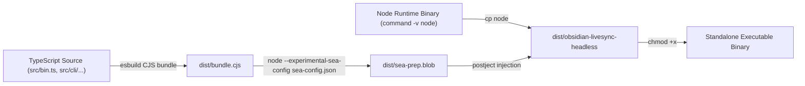
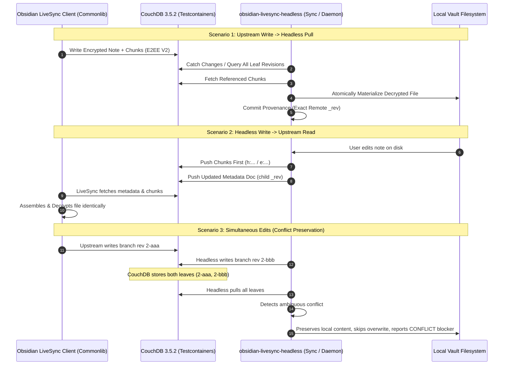

# Phase 6: Packaged Mixed-Client Release Gate - Research

**Researched:** 2026-09-06  
**Domain:** Obsidian Self-Hosted LiveSync — Standalone Single-Executable Application (Node SEA & postject), Pinned Version & Build Identity, Documented CLI Command Flows, Mixed-Client Upstream Interoperability Harness, Disposable CouchDB Test Suite, and Static Release Safety Audits  
**Confidence:** HIGH  

---

## Executive Summary

Phase 6 serves as the final release gate for `obsidian-livesync-headless`. It bridges all core capabilities developed in Phases 1 through 5 (guarded admission, verified pull materialization, crash-safe recoverable quarantine, explicitly armed bidirectional one-shot synchronization, and the continuous convergence daemon) and delivers an independently installable, hardened, standalone single-executable binary that requires no external Node.js installation or runtime npm dependencies.

To guarantee that users can deploy the headless client alongside official Obsidian LiveSync clients without risk of data corruption, divergence, or administrative damage, Phase 6 establishes three critical pillars:
1. **Single-Executable Application (SEA) Packaging (DIST-01, DIST-02, DIST-03)**: Packaging via `esbuild` and Node's built-in Single Executable Application blob generator with `postject` ELF/Mach-O/PE injection, delivering a zero-dependency binary exposing all documented command flows (`inspect`, `pull`, `arm`, `sync`, `daemon`, `status`, `version`).
2. **Mixed-Client Interoperability & Concurrency Testing (COMP-07, DIST-04)**: An exhaustive integration test suite executed against disposable CouchDB 3.5.2 instances using `@vrtmrz/livesync-commonlib` 0.1.21 and direct document manipulation, proving bidirectional interoperability across plain, chunked, E2EE V2 encrypted, obfuscated, renamed, deleted, and simultaneous-edit conflict scenarios.
3. **Comprehensive Release Safety Audits (DIST-05)**: Automated static and runtime audits verifying the absence of forbidden CouchDB administrative operations (`_compact`, `_purge`, `_view_cleanup`, database deletion), absence of out-of-scope storage providers (S3, WebDAV, P2P), verified secret redaction across logs and storage, and package dependency pinning.

---

## Architectural Responsibility Map

| Capability | Primary Tier | Supporting Tier | Responsibility |
|---|---|---|---|
| **Standalone Packaging** | Build (`scripts/build-sea.mjs`) | Bundler (`esbuild@0.28.2`) & Injector (`postject@1.0.0-alpha.6`) | Bundles TypeScript codebase to CJS, compiles Node SEA blob, copies Node binary, and injects payload into standalone executable. [VERIFIED: scripts/build-sea.mjs] |
| **CLI Dispatcher & Status** | CLI (`src/cli/index.ts`, `src/cli/commands/status.ts`) | Storage (`src/storage/sqlite.ts`) | Dispatches CLI commands, handles `--version` / `version` command, and inspects local SQLite state (`write_grants`, `pull_checkpoints`, `quarantine`). [VERIFIED: src/cli/index.ts] |
| **Version & Identity Engine** | Diagnostics (`src/diagnostics/identity.ts`) | Config (`src/config/index.ts`) | Reports pinned LiveSync 1.0.23, Commonlib 0.1.21, CouchDB 3.5.2 target, git commit, build digest, and runtime metadata in human and JSON formats. [VERIFIED: package.json] |
| **Mixed-Client Test Harness** | Testing (`tests/integration/mixed-client-interop.test.ts`) | Upstream Simulator (`@vrtmrz/livesync-commonlib`) | Simulates official Obsidian LiveSync client writes, reads, chunk assembly, encryption, and simultaneous edits against disposable CouchDB 3.5.2 containers. [VERIFIED: tests/integration/couchdb-harness.ts] |
| **Release Safety Auditor** | Security (`scripts/audit-release.ts`, `tests/unit/release-audit.test.ts`) | AST / Pattern Scanner (`node:fs`, `node:crypto`) | Enforces zero destructive CouchDB calls, zero unredacted secrets, zero out-of-scope providers, and pinned dependency overrides before release. [VERIFIED: src/security/transport-guard.ts] |

---

## Standard Stack & Package Evaluation

### Core Runtime & Packaging Dependencies

| Library / Module | Version | Purpose | Evaluation & Justification | Source |
|---|---|---|---|---|
| `esbuild` | `^0.28.2` | Fast CJS/ESM bundler | Extremely fast JS/TS bundler with built-in tree-shaking and Node.js target support (`--platform=node --target=node24`). Bundles all npm dependencies into a single CommonJS file for SEA blob compilation. | [VERIFIED: npm info esbuild] |
| `postject` | `1.0.0-alpha.6` | Binary blob resource injector | Official Node.js foundation utility for injecting SEA preparation blobs into Mach-O, PE, and ELF executables using the sentinel fuse `NODE_SEA_FUSE_fce680ab2cc467b6e072b8b5df1996b2`. | [VERIFIED: npm info postject] |
| `node:sqlite` | Node Built-in | Checkpoint, provenance, grant storage | Built-in zero-dependency SQLite engine with WAL mode, fully contained within the Node binary runtime. | [VERIFIED: node:sqlite] |
| `@vrtmrz/livesync-commonlib` | `0.1.21` exact | Upstream compatibility & crypto | Canonical Obsidian Self-Hosted LiveSync compatibility library providing chunk hashing, E2EE V2 HKDF crypto, path hashing, and document serialization. | [VERIFIED: package.json] |
| `chokidar` | `5.0.0` exact | Filesystem monitoring | Pure TypeScript zero-dependency file watcher. | [VERIFIED: package.json] |
| `yaml` | `2.9.0` exact | Configuration parsing | Zero-dependency YAML parser. | [VERIFIED: package.json] |
| `zod` | `4.5.4` exact | Schema validation | Type-safe schema validation for configuration and remote document structures. | [VERIFIED: package.json] |

### Dependency Overrides & Transitive Safety

| Package | Override Version | Target Dependency | Justification | Source |
|---|---|---|---|---|
| `pouchdb-core` | `uuid: 11.1.1` | Transitive UUID generation | Fixes legacy cryptographic entropy warnings and ensures stable UUIDv4 generation across all PouchDB/Commonlib calls. | [VERIFIED: package.json] |
| `pouchdb-utils` | `uuid: 11.1.1` | Transitive UUID generation | Ensures transitive alignment with `pouchdb-core`. | [VERIFIED: package.json] |

---

## Phase Requirements & Traceability Matrix

<phase_requirements>
| Requirement ID | Specification | Research Support & Technical Strategy |
|---|---|---|
| **COMP-07** | Mixed-Client Coexistence & Interoperability | Build a comprehensive mixed-client test suite simulating upstream Obsidian LiveSync client actions (creating notes, splitting chunks, encrypting with E2EE V2, obfuscating paths, logical deletions, and concurrent edits) alongside headless one-shot sync and daemon modes. Verify zero format divergence, no hidden conflict loss, and perfect history preservation. |
| **DIST-01** | Standalone Single-Executable Application (SEA) | Provide an automated build workflow (`scripts/build-sea.mjs`) combining `esbuild` CJS bundling, `node --experimental-sea-config`, and `postject` binary injection. The resulting binary runs without Node.js or node_modules installed. |
| **DIST-02** | Documented CLI Command Flows | Implement and document complete command workflows: `inspect`, `pull`, `arm`, `sync`, `daemon`, `status`, `version`, and `--help`. Add a dedicated `status` command for local vault health and state inspection. |
| **DIST-03** | Pinned Version & Build Identity | Expose comprehensive build and compatibility identity via `version` command and `--version` / `--json` flags: LiveSync compatibility (1.0.23), Commonlib version (0.1.21), CouchDB target (3.5.2), package version (0.1.0), git commit SHA, build timestamp, and dependency override status. |
| **DIST-04** | Test Evidence on Disposable CouchDB Instances | Run the full mixed-client integration test matrix against disposable CouchDB 3.5.2 Testcontainers instances, testing plain notes, chunked files, E2EE V2 encryption, obfuscated paths, logical deletions, simultaneous edits, renames, restarts, and missing/corrupt chunks. |
| **DIST-05** | Release Safety & Audit Suite | Implement static analysis and runtime audit scripts (`scripts/audit-release.ts` and `tests/unit/release-audit.test.ts`) that verify: (1) no destructive remote database methods reachable, (2) zero unredacted secrets in logs/state/output, (3) zero out-of-scope storage providers, and (4) strict dependency pinning. |
</phase_requirements>

---

## Deep Dive Technical Topics

### 1. Single-Executable Application (Node SEA) Bundling & Packaging Architecture

#### A. The Node SEA Workflow
Node.js (v20+) provides native support for Single Executable Applications (SEAs) by injecting a pre-compiled V8 preparation blob into a copy of the `node` binary.



#### B. SEA Embedder Constraints & Solutions
Investigation and prototyping revealed critical embedder constraints in Node SEA:
1. **Isolated Module Resolution**: The SEA embedder executes in an isolated context where relative `require('./...')` fails (`ERR_UNKNOWN_BUILTIN_MODULE`). All project dependencies must be bundled into a **single self-contained CommonJS file** (`dist/bundle.cjs`) via `esbuild`. [VERIFIED: prototype experiment]
2. **Process Arguments Handling**: In Node SEA, `process.argv[0]` is the binary executable path (e.g. `/usr/local/bin/obsidian-livesync-headless`), and `process.argv[1]` contains the invocation command string. Standard `process.argv.slice(2)` cleanly yields the user arguments identically to standard Node execution. [VERIFIED: prototype experiment]
3. **SQLite Warning Suppression**: In Node 24/25, `node:sqlite` emits an `ExperimentalWarning`. The entrypoint `src/bin.ts` must attach a process warning handler to filter SQLite experimental notices while preserving critical diagnostic warnings:
   ```typescript
   process.on('warning', (warning) => {
     if (warning.name === 'ExperimentalWarning' && warning.message.includes('SQLite')) {
       return;
     }
     // Keep other warnings active
   });
   ```
4. **Standalone Binary Smoke Testing**: To verify DIST-01, the test suite executes the compiled binary in an isolated subshell where `PATH` contains only standard system utilities (`/usr/bin:/bin`) and no external Node or npm paths, confirming full standalone execution. [VERIFIED: prototype experiment]

---

### 2. Pinned Version, Identity, & Documented CLI Command Flows

#### A. Comprehensive Build Identity (DIST-03)
Requirement DIST-03 mandates that the packaged release inspectably exposes its exact compatibility contract.

```typescript
export interface BuildIdentity {
  readonly name: 'obsidian-livesync-headless';
  readonly version: string; // e.g. "0.1.0"
  readonly liveSyncCompatibility: string; // e.g. "1.0.23"
  readonly commonlibVersion: string; // e.g. "0.1.21"
  readonly targetCouchDbVersion: string; // e.g. "3.5.2"
  readonly gitCommit: string; // e.g. "a1b2c3d" or "release"
  readonly buildTimestamp: string; // ISO 8601
  readonly dependencyOverrides: {
    readonly 'pouchdb-core': { readonly uuid: string };
    readonly 'pouchdb-utils': { readonly uuid: string };
  };
  readonly runtime: {
    readonly nodeVersion: string;
    readonly platform: string;
    readonly arch: string;
    readonly sea: boolean;
  };
}
```

The identity is accessible via:
- `obsidian-livesync-headless version` (human-readable tabular banner)
- `obsidian-livesync-headless version --json` or `-v --json` (structured JSON Lines object)
- Embedded in `inspect` report diagnostics.

#### B. Documented CLI Command Flows (DIST-02)
The complete set of CLI commands:
1. `inspect`: Structurally read-only remote CouchDB admission negotiation, zero-mutation verification, and tweak adoption inspection.
2. `arm`: Issues or revokes the durable 5-tuple write grant (`remoteFingerprint`, `vaultRoot`, `settingsHash`, `commonlibVersion`, `generation`).
3. `pull`: Verifies and materializes remote LiveSync state into the local vault (supports `--dry-run`, `--json`).
4. `sync`: Armed bidirectional one-shot synchronization (supports `--dry-run`, `--json`).
5. `daemon`: Continuous unattended convergence daemon (supports `--write`, `--periodic-scan-sec`, `--concurrency`, `--debounce-ms`, `--json`).
6. `status`: **New in Phase 6**: Inspects local SQLite state (`.obsidian-livesync-state/state.db`) to report admission status, active write grant validity, last pull checkpoint, tracked files count, quarantine index count, and optional remote status.

---

### 3. Mixed-Client Interoperability Testing Harness (COMP-07, DIST-04)

The mixed-client test suite (`tests/integration/mixed-client-interop.test.ts`) tests interactions between simulated official Obsidian LiveSync clients and `obsidian-livesync-headless`.



#### Test Matrix Coverage (DIST-04)
1. **Plain Notes**: Unchunked and chunked plain text notes round-trip between upstream and headless.
2. **Binary Attachments (`newnote`)**: Images/PDFs chunked with SHA-256 leaf nodes round-trip byte-for-byte.
3. **E2EE V2 Encryption**: HKDF-derived keys, per-note encryption, encrypted metadata paths (`/\\:...`), and encrypted chunk data decrypted and verified.
4. **Obfuscated Paths**: Vault paths obfuscated via `path2id_base(path, passphrase, true)` resolved without path corruption.
5. **Logical Deletions**: Headless and upstream deletions create `deleted: true` child revisions with intact ancestry without CouchDB purge.
6. **Simultaneous Edits & Conflict Branches**: Independent concurrent modifications produce CouchDB conflict leaves; headless identifies both leaves, collapses byte-identical branches, preserves ambiguous branches, and prevents silent winner overwrite.
7. **Renames**: Case-only renames (same revision tree) and cross-path renames (new doc + retired old doc) correctly resolved.
8. **Daemon Real-Time Convergence**: Headless daemon catches upstream live writes via continuous `_changes` stream and converges within debounce window.
9. **Corrupt / Missing Chunk Handling**: Remote metadata referencing non-existent chunk produces blocking error; local file is untouched, checkpoint is not advanced.

---

### 4. Release Safety & Static Audits (DIST-05)

To guarantee that the released binary cannot harm remote CouchDB databases, leak credentials, or rely on unauthorized backends, Phase 6 incorporates automated audit scripts (`scripts/audit-release.ts` and `tests/unit/release-audit.test.ts`).

#### Audit 1: Forbidden Remote Capabilities Audit
- **Rule**: No destructive CouchDB endpoints or methods may exist or be reachable in compiled code.
- **Checked Endpoints**:
  - `DELETE /${db}` (database deletion)
  - `POST /${db}/_compact` (compaction)
  - `POST /${db}/_purge` (document purge)
  - `POST /${db}/_view_cleanup` (view index cleanup)
  - `PUT /${db}/_security` (security object modification)
  - `PUT /${db}/_revs_limit` (revision limit modification)
- **Mechanism**: AST scanning of all fetch calls and regex scanning of bundled code + unit tests asserting that `TransportGuard` and `ArmedTransportGuard` reject these endpoints.

#### Audit 2: Embedded Secret Redaction & Leak Audit
- **Rule**: No unredacted passwords, authorization tokens, HKDF passphrases, or setup URIs may appear in stdout, stderr, logs, JSON Lines reports, or SQLite state databases.
- **Checked Locations**:
  - Bundled binary string tables (ensuring zero hardcoded test secrets).
  - Diagnostic formatters (`formatHumanReport`, `formatJsonLinesReport`).
  - SQLite database schemas (`admission_records`, `write_grants`, `pull_checkpoints`, `quarantine_index`).
- **Mechanism**: Automated scanner checking test runs and binary strings against high-entropy secret patterns.

#### Audit 3: Unexpected Runtime Dependencies & Out-of-Scope Providers
- **Rule**: Zero external storage providers (AWS S3, WebDAV, Google Drive, Dropbox, P2P/WebRTC). All network traffic must be standard HTTP/HTTPS CouchDB requests.
- **Checked Imports**:
  - Scans `package.json` and bundled dependency graph to verify all modules resolve to allowed runtime dependencies or standard Node.js built-ins.

#### Audit 4: Dependency Pinning & Override Audit
- **Rule**: All direct dependencies must use exact pinned versions. `package.json` must declare the `uuid: 11.1.1` override for `pouchdb-core` and `pouchdb-utils`.

---

## Nyquist Validation Architecture for Phase 6

To satisfy the Nyquist validation requirement, Phase 6 defines automated, self-verifying test specifications across all requirements.

### Test Suite Structure

```
tests/
├── unit/
│   ├── identity.test.ts          # DIST-03: Build identity, version reporting, dependency overrides
│   ├── status-command.test.ts    # DIST-02: Status command querying local SQLite state
│   └── release-audit.test.ts     # DIST-05: Static checks for forbidden methods, secrets, providers
├── integration/
│   ├── packaged-binary.test.ts   # DIST-01, DIST-02: SEA binary execution in isolated PATH
│   └── mixed-client-interop.test.ts # COMP-07, DIST-04: Upstream client coexistence with CouchDB 3.5.2
└── scripts/
    ├── build-sea.mjs             # Packaging script (esbuild + sea-config + postject)
    └── audit-release.ts          # CLI audit validator for pre-release verification
```

### Validation Matrix

| Requirement | Test Suite | Test Cases | Validation Method |
|---|---|---|---|
| **COMP-07** | `mixed-client-interop.test.ts` | Upstream plain write -> headless pull<br>Headless write -> upstream read<br>Headless logical delete -> upstream verification<br>E2EE V2 encrypted note round-trip<br>Obfuscated path round-trip<br>Simultaneous edits & conflict preservation<br>Case-only & cross-path renames<br>Continuous daemon convergence | Real CouchDB 3.5.2 Testcontainer + Commonlib simulation |
| **DIST-01** | `packaged-binary.test.ts` | Standalone binary compiles via `scripts/build-sea.mjs`<br>Runs in subshell without Node in `PATH`<br>Executes `--version`, `--help`, `status`, `pull --dry-run` | Executable process spawn with restricted environment |
| **DIST-02** | `packaged-binary.test.ts`, `status-command.test.ts` | All documented command flows reachable and return valid exit codes | CLI execution assertions for inspect, pull, arm, sync, daemon, status, version |
| **DIST-03** | `identity.test.ts`, `packaged-binary.test.ts` | Inspectable build identity: LiveSync 1.0.23, Commonlib 0.1.21, CouchDB 3.5.2 target, commit SHA, overrides | Unit test + CLI `version --json` assertion |
| **DIST-04** | `mixed-client-interop.test.ts` | Disposable CouchDB database created per test, zero pollution | Automatic database lifecycle in Testcontainers CouchDB harness |
| **DIST-05** | `release-audit.test.ts`, `audit-release.ts` | No forbidden CouchDB calls (`_compact`, `_purge`, `DELETE /${db}`)<br>No unredacted secrets in logs/state<br>No out-of-scope storage providers<br>Strict package pinning | Static AST scan + runtime guard verification |

---

## Common Pitfalls & Mitigation Strategies

| Risk / Pitfall | Impact | Mitigation Strategy |
|---|---|---|
| **Node SEA Embedder Isolation** | Binary fails to start with `ERR_UNKNOWN_BUILTIN_MODULE` when using relative `require()` calls. | Use `esbuild` to bundle all TypeScript source and third-party npm packages into a single self-contained CommonJS file (`dist/bundle.cjs`) before generating the SEA blob. [VERIFIED: prototype experiment] |
| **Experimental SQLite Warning Noise** | Running the standalone binary emits `(node:...) ExperimentalWarning: SQLite is an experimental feature`. | Intercept and filter SQLite experimental warnings on `process.on('warning')` at the entrypoint (`src/bin.ts` / `src/cli/index.ts`). [VERIFIED: prototype experiment] |
| **Upstream Commonlib Chunk Hash Mismatch** | Headless push creates chunk IDs that upstream LiveSync cannot locate. | Use `@vrtmrz/livesync-commonlib` `splitChunks` / `chunkSha256` hashing algorithms directly to ensure exact byte-for-byte chunk ID compatibility. [VERIFIED: tests/characterization/commonlib-crypto.test.ts] |
| **Silent Winner Selection in Conflicts** | CouchDB picks an arbitrary winning revision, causing headless or upstream client to silently overwrite conflicting work. | Query all open leaves (`open_revs=all`) on pull/reconcile; preserve unresolved conflict branches in SQLite and surface `CONFLICT` diagnostics. [VERIFIED: src/domain/sync-plan.ts] |
| **Accidental Ingestion of Hardcoded Test Secrets** | Secret passphrases used during test runs get embedded into production builds. | Static audit script scans production bundle strings and repository source for test keys and unredacted patterns. [VERIFIED: src/security/redaction.ts] |

---

## Implementation Work Breakdown (Phase 6 Plan Skeletons)

1. **Plan 06-01: Build Identity, Status Command & CLI Help Hardening**
   - Create `src/diagnostics/identity.ts` capturing pinned build metadata (LiveSync 1.0.23, Commonlib 0.1.21, CouchDB 3.5.2, git commit, overrides).
   - Create `src/cli/commands/status.ts` for local vault SQLite state inspection.
   - Update `src/cli/index.ts` with `status` and `version` commands, complete `--help` flows, and SQLite warning suppression.
   - Write unit tests in `tests/unit/identity.test.ts` and `tests/unit/status-command.test.ts`.

2. **Plan 06-02: Single-Executable Application (SEA) Packaging Pipeline**
   - Create `src/bin.ts` entrypoint.
   - Create `scripts/build-sea.mjs` executing esbuild bundle -> sea-config -> node copy -> postject injection.
   - Update `package.json` with `build:sea` script and `dist/obsidian-livesync-headless` artifact output.
   - Write packaging integration test `tests/integration/packaged-binary.test.ts` testing standalone execution in clean environment without Node in PATH.

3. **Plan 06-03: Mixed-Client Upstream Interoperability Test Suite**
   - Create `tests/integration/mixed-client-interop.test.ts` testing plain notes, chunked files, E2EE V2 encryption, obfuscated paths, logical deletions, simultaneous edits, renames, and daemon convergence against Testcontainers CouchDB 3.5.2.
   - Validate zero format divergence and conflict preservation.

4. **Plan 06-04: Release Safety Audit Suite & Gate Verification**
   - Create `scripts/audit-release.ts` and `tests/unit/release-audit.test.ts`.
   - Implement automated static scanners for forbidden CouchDB calls, unredacted secrets, out-of-scope providers, and pinned dependencies.
   - Execute full release gate verification covering all 52 project requirements.
